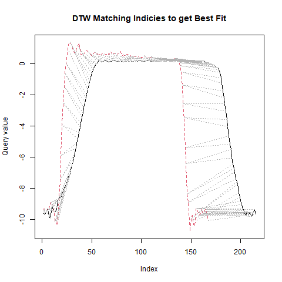
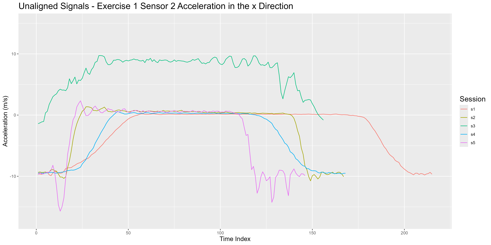
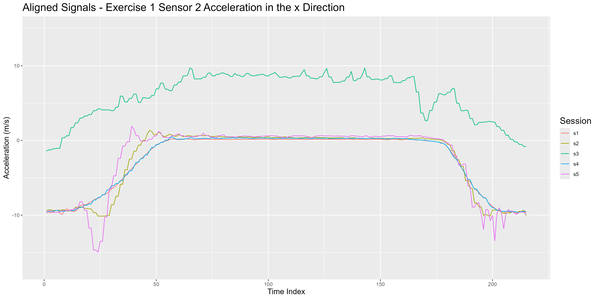
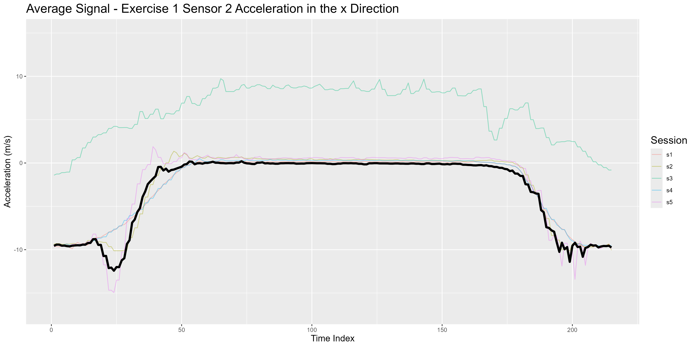

```{r setup, include=FALSE}
knitr::opts_chunk$set(echo = FALSE)
```

# Abstract

Physical therapy is an effective and often necessary part of rehabilitation for patients recovering from surgery or injury. As a result of limited resources, many patients must perform these exercises by themselves or at home with no supervision which can lead to incorrectly performed exercises and sub-optimal rehabilitation. In this paper, we analyze motion sensor data from 5 participants performing 8 exercises in 3 different ways (correctly performed, too fast, and low amplitude). Our goal is to use data from the wearable motion sensors to provide feedback that can help patients consistently perform these exercises correctly. We explore methods using Dynamic Time Warping and Time Series Analysis to generate this feedback. We found that Dynamic Time Warping methods can classify individual exercises with 100% accuracy, identify when and how many reps of an exercise is performed in a session with 75.63% accuracy, and very poorly identify the quality of each rep with 5.42% accuracy. When using detrending and sin regression in combination with random forests, our best model is able to classify exercises with 80% accuracy. These methods give a promising start to a way to provide feedback on independently performed physical therapy exercises using wearable motion sensors but needs some more refinement to give consistent and useful feedback to patients.

# Introduction

When providing physical therapy, most physical therapists rely on their professional oversight and patient discretion to ensure proper execution of an exercise. After a few initial sessions with the patient, it is usually prescribed to continue these exercises at home. Although this has proven effective, it can result in a sub-optimal success rate due to time constraints of the therapist and lack of feedback for patients practicing at home.

It is clear to see that the standard practice does not ensure maximum utility from this method of rehabilitation. In this paper, we will explore some methods to evaluate physical therapy sessions based on motion sensors placed on the patient. This will allow us to provide consistent feedback to patients practicing at home and improve the effectiveness of physical therapy treatments.

The methods in this paper could be used for an exercise application. Many people use an app called Strava to log their runs, hikes, and bicycle rides. Strava users can see their friends' activities and compete for record times on certain trails or roads. A major issue with Strava is that people can cheat by doing things like driving part of their "run", or logging a bicycle ride as a run. If an app like Strava could connect to a sensor that could accurately identify the activity that someone is performing, the app would be able to catch these cheaters. Additionally, users would be able to see more data on their activities.

We have four primary objectives. First, we want to be able to correctly identify the exercise a patient is doing. If we have sensors on a new subject, can we use data from previous subjects to determine what exercise the new subject is doing? Second, can we determine the quality of a rep? Exercises can be incorrectly performed by being too fast or with a limited range of motion, so we want to be able to detect these errors as well. Third, do we need all of our data to be able to complete the first two objectives? Reducing the amount of sensors a patient has to wear improves ease of use as well as reduces the complexity of our algorithms. And finally, how long does the subject need to be performing the exercise in order to correctly classify the exercise. If the patient only has time to do a few reps, ideally we will still be able to determine what exercise they are performing by using previous data.

# Data

Our data was collected from the UC Irvine Machine Learning Repository with accompanying paper "Automated Evaluation of Physical Therapy Exercises Using Multi-template Dynamic Time Warping on Wearable Sensor Signals" \textcolor{red}{citation here}.

The data set contains 5 sessions. Each session, a subject performs 8 different exercises while wearing 5 motion sensors on different parts of their body. Each sensor takes 9 measurements at 25 Hz while the subject is performing the exercise. In all directions ($x$, $y$, and $z$) the sensor calculates the acceleration ($\frac{\text{meters}}{\text{second}^2}$), angular rate ($\frac{\text{radians}}{\text{second}}$), and magnetic field (relative). This means that with 5 sensors and 9 measurements per sensor, there are 45 continuous measurements that describe a session. Figure 1 shows what these 45 measurements look like for the first exercise in the first session in our data set.

```{r fig.cap="Example of data for a signle session", fig.align='center'}
knitr::include_graphics("plots/e1_s1_all_signals.png")
```

There are two data sets for each combination of subject, exercise, and sensor. A template session which contains 3 executions of each 3 execution types (correct, too fast, and low amplitude), and a test session which contains 10 executions of each 3 execution types.

## Exercises in the Data

As mentioned previously, we have 8 different exercises in our data. The four lower body exercises are exercises 1, 3, 4, and 5. The four upper body exercises are 2, 6, 7, and 8. Diagrams of these can be seen in figure 2. There are also different sensor configurations for lower and upper body exercises shown in figure 3.

```{r fig.cap="Diagram of the 8 exercises", out.width="50%", fig.align='center'}
knitr::include_graphics("plots/exercise_diagrams.png")
```

```{r fig.cap="Diagram of sensor placement"}
knitr::include_graphics("plots/sensor_placement.png")
```

# Methods

## Method 2: Dynamic Time Warping

Dynamic time warping (DTW) is an algorithm that "stretches and squeezes" time to align and compare signals. There are many versions of this algorithm, but the type we use is already implemented in the DTW package in R (Giorgino, 2009). Our chosen step pattern is typeIIIc as described by Myers (1980). A visualization of how DTW aligns two signals can be found in figure \textcolor{red}{fig number}.

```{r fig.cap="DTW aligning two signals from different sessions"}

```

### Classifying With DTW

In order to classify an exercise $e$, we go through the following steps:

1.  Find the average signal for each 8 exercise types.
2.  Select the $n$ highest variance signals to compare.
3.  Compare the $n$ highest variance signals from $e$ to the corresponding signals from each 8 average exercises using DTW and sum up the $n$ distance measures.
4.  Classify as the exercise with the lowest total distance measure.

#### Step 1: Finding the Average Signal For Each Exercise

The purpose of finding the average signal for each exercise is to have a benchmark to compare against. Averaging reduces variance when more data points are averaged over, so by averaging we can remove variance and get closer to the core of what makes the exercise this particular exercise.

As a quick recap: we have 45 continuous measurements that describe an exercise. We want to keep this shape when we average because we want to be able to compare individual exercises against the average. So, we will go signal by signal and find the average for each of the 45 continuous signals.

Let's look at the process for finding the average of one signal. Once we understand that, we can repeat for all other signals of the exercise. In figure \textcolor{red}{fig number} we have 5 original signals, each from different sessions and corresponding to exercise 1, sensor 2, acceleration in the x direction. We want to find the average of these 5 signals.

```{r fig.cap="Original unaligned signals"}

```

The first step is to align these signals. The DTW R package returns two vectors that can be used to align two signals $s_1$ and $s_2$. Let's suppose $s_1$ is the longer signal and therefore the one that will remain unchaged. The vector that corresponds to $s_1$, $v_1$, contains indices of the vector that is remaining unchanged. $v_1$ just contains the indexes of $s_1$. The second vector $v_2$ corresponds to $s_2$ and is the length of the first vector, but might repeat or skip numbers to match a point on $s_2$ to its closest match on $s_1$. For example, if the fifth index of $s_2$ matches best with the seventh index of $s_1$, 5 will be in the seventh spot of $v_2$. Here's a simple example where the best alignment is stretching the first part of $s_2$:

$$
v_1 = (1,2,3,4,5,6,7,8,9,10,...)
$$

$$
v_2 = (1,2,2,3,4,4,5,6,7,7,...)
$$

With these vectors we align the signals one by one, aligning the shorter signal to the longest signal. After this is done, we get the signals in figure \textcolor{red}{fig num}.

```{r fig.cap="Aligned signals"}

```

After this is done, we can take the average at each index and we have our average signal (figure \textcolor{red}{fig num}). Repeat for each 45 signals that describe the exercise and we have a set of signals that describe the average exercise.

```{r fig.cap="Average signal"}

```

# Results

# Limitations

# Improvements

# References
