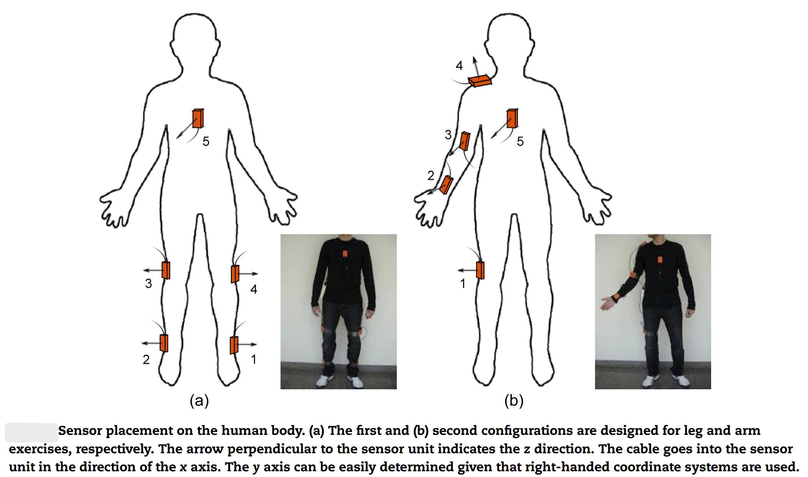

```{r setup, include=FALSE}
knitr::opts_chunk$set(echo = FALSE)
```

# Introduction

When providing physical therapy, most physical therapists rely on their professional oversight and patient discretion to ensure proper execution of an exercise. After a few initial sessions with the patient, it is usually prescribed to continue these exercises at home. Although this has proven effective, it can result in a sub-optimal success rate due to time constraints of the therapist and lack of feedback for patients practicing at home.

It is clear to see that the standard practice does not ensure maximum utility from this method of rehabilitation. In this paper, we will explore some methods to evaluate physical therapy sessions based on motion sensors placed on the patient. This will allow us to provide consistent feedback to patients practicing at home and improve the effectiveness of physical therapy treatments.

The methods in this paper could be used for an excercise application. Many people use an app called Strava to log their runs, hikes, and bicycle rides. Strava users can see their friends' activites and compete for record times on certain trails or roads. A major issue with strava is that people can cheat by doing things like driving part of their "run", or logging a bicycle ride as a run. If an app like strava could connect to a sensor that could accurately identify the activity that someone is performing, the app would be able to catch these cheaters. Additionally, users would be able to see more data on their activities.

We have four primary objectives. First, we want to be able to correctly identify the exercise a patient is doing. If we have sensors on a new subject, can we use data from previous subjects to determine what exercise the new subject is doing? Second, can we determine the quality of a rep? Exercises can be incorrectly performed by being too fast or with a limited range of motion, so we want to be able to detect these errors as well. Third, do we need all of our data to be able to complete the first two objectives? Reducing the amount of sensors a patient has to wear improves ease of use as well as reduces the complexity of our algorithms. And finally, how long does the subject need to be perfoming the exercise in order to correctly classify the exercise. If the patient only has time to do a few reps, ideally we will still be able to determine what exercise they are performing by using previous data.

# Data

The data was collected from the UC Irvine Machine Learning Repository, with accompanying paper "Automated Evaluation of Physical Therapy Exercises Using Multi-template Dynamic Time Warping on Wearable Sensor Signals" \textcolor{red}{citation here}.

The data set contains 5 sessions. For each session, a subject performs 8 different exercises while wearing 5 motion sensors on different parts of their body. Each sensor takes 9 measurements at 25 Hz while the subject is performing the exercise. In all directions ($x$, $y$, and $z$) the sensor calculates the acceleration ($\frac{\text{meters}}{\text{second}^2}$), angular rate ($\frac{\text{radians}}{\text{second}}$), and magnetic field (relative). This means that with 5 sensors and 9 measurements per sensor, there are 45 continuous measurements that describe a session. Figure 1 shows what these 45 measurements look like for the first exercise in the first session in our data set.

```{r fig.cap="Example of data for a signle session", fig.align='center'}
knitr::include_graphics("plots/e1_s1_all_signals.png")
```

There are two data sets for each combination of subject, exercise, and sensor: A template session which contains 3 executions of each 3 execution types (correct, too fast, and low amplitude), and a test session which contains 10 executions of each 3 execution types.

## Exercises in the Data

As mentioned previously, we have 8 different exercises in our data. The four lower body exercises are exercises 1, 3, 4, and 5. The four upper body exercises are 2, 6, 7, and 8. Diagrams of these can be seen in figure 2. There are also different sensor configurations for lower and upper body exercises shown in figure 3. Sensors are placed in different areas for lower body and upper body exercises with the exception of sensor 5, which is always on the upper middle area of the subject's back.

```{r fig.cap="Diagram of the 8 exercises", out.width="50%", fig.align='center'}

```

```{r fig.cap="Diagram of sensor placement"}

```

# Methods

# Results

# Limitations

# Improvements

# References
